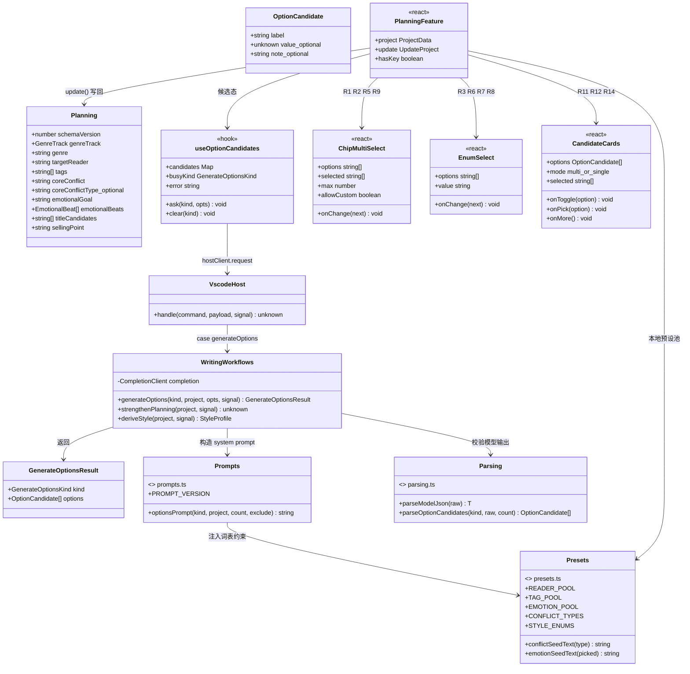
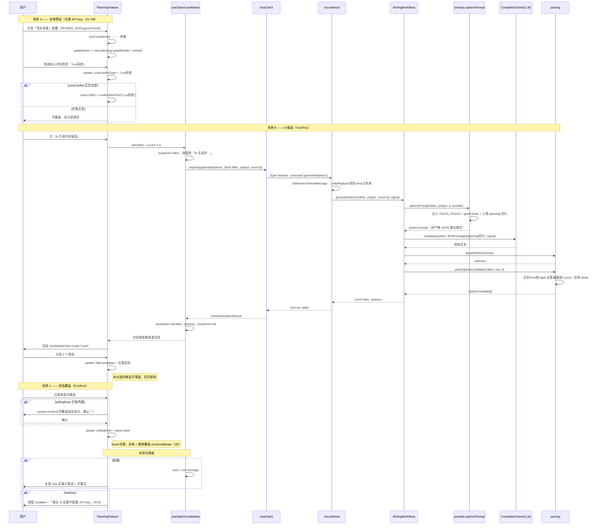
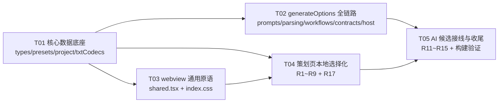

# 系统设计：策划页「选择式填写」增量改造

> 增量设计文档，配套 PRD：`design/PRD-策划页选择式填写-增量.md`。未提及部分维持现状。
> 范围：P0 R1~R13 + P1 R14/R15/R17。R16/R18~R20 预留接入点，本次不实现。

---

## 1. 实现方案与选型

**沿用现有栈，零新增 npm 依赖**：`packages/core`（纯 TS 领域层）→ `packages/contracts`（RPC 契约）→ `src/adapters/vscodeHost.ts`（扩展宿主）→ `webview`（React 18 + Vite）。

三个技术难点与解法：

| 难点 | 解法 |
|---|---|
| **词表漂移**：预设池同时被 prompt 与 UI 消费，分两处必然不一致 | 新建 `packages/core/src/presets.ts` 作为**单一事实源**，与 `GENRE_TACTICS` 同层，从 `core/index.ts` 统一导出；webview 通过 `@tomato-writer/core` 引用 |
| **5 类候选 × 1 套 UI 协议**：titles/sellingPoints/tags/targetReaders/beats 返回形状不同 | 单一 RPC `generateOptions` + **统一信封** `{kind, options: OptionCandidate[]}`；kind 差异只体现在 prompt 模板与 parsing 层的 `value` 校验，UI 侧只认信封 |
| **旧 `本书策划.txt` 兼容**：`decodePlanningTxt` 用 `requireSection` 严格解析，且 `parseSections` 对**未知区块直接抛错** | 新字段 `coreConflictType` 全链路 optional：decode 走 `value.get()` 可选读 + 区块名加入 `names` 白名单；encode **仅在非空时**写出该段（空值不落段 → 旧项目 txt 字节不变，`tests/txtCodecs.test.ts:40` 往返断言不受影响） |

**架构模式**：维持现有分层（Domain Core / Contract / Adapter / View）。webview 侧新增一层「无状态展示原语」（shared.tsx）与一个「候选态 hook」，候选数据**只存 React state，不落盘、不进 project**，切页即弃（PRD §4 约束）。

---

## 2. 文件列表（逐文件说明改什么）

| # | 相对路径 | 类型 | 改动说明 |
|---|---|---|---|
| 1 | `packages/core/src/types.ts` | 改 | `Planning` 增 `coreConflictType?: string`（L10-14）。`targetReader` 保持 `string`（Q1）。`StyleProfile` 不动 |
| 2 | `packages/core/src/presets.ts` | **新** | 分轨预设池 + 冲突类型枚举 + 文风枚举 + 两个种子文案纯函数。无副作用、只依赖 `./types` |
| 3 | `packages/core/src/index.ts` | 改 | 增 `export * from './presets';`（webview 可见的必要条件） |
| 4 | `packages/core/src/prompts.ts` | 改 | 新增 `GenerateOptionsKind` 类型与 `optionsPrompt(kind, project, count, exclude)`；`PROMPT_VERSION` L3 bump `2026.07-v3` → `2026.07-v4`。**不动** `subtypePrompt`/`planningPrompt`/`stylePrompt` |
| 5 | `packages/core/src/parsing.ts` | 改 | 新增 `OptionCandidate` 类型与 `parseOptionCandidates(kind, raw, count)`；复用现有 `isRecord`。**不动** `parseModelJson` 本体 |
| 6 | `packages/core/src/workflows.ts` | 改 | `WritingWorkflows` 增 `generateOptions(...)`，范式对齐 `generateAsset`（L138）：`this.complete(...)` → `parseModelJson` → 专用 parser |
| 7 | `packages/core/src/txtCodecs.ts` | 改 | `encodePlanningTxt`（L133）条件写出「核心冲突类型」段；`decodePlanningTxt`（L151）`names` Set 加名 + `value.get()` 可选读 |
| 8 | `packages/core/src/project.ts` | 改 | `createProjectData` 的 `planning` 字面量（L62-66）补 `coreConflictType: ''`。`SCHEMA_VERSION` **不升**（见 §7） |
| 9 | `packages/contracts/src/index.ts` | 改 | **三处**：`CommandMap` 增 `generateOptions` 条目（L55 前）、`commands` Set 补名（L82-89）、`validPayload` 补 case（参考 `generateAsset` L137-138 的 kind 白名单写法） |
| 10 | `src/adapters/vscodeHost.ts` | 改 | 命令 switch 增 `case 'generateOptions'`（紧邻 L505 `generateOutline`）。宿主侧**无 API Key 门控**（已核实），R13 纯 UI 实现 |
| 11 | `webview/src/features/shared.tsx` | 改 | 新增 3 个通用原语 `ChipMultiSelect` / `EnumSelect` / `CandidateCards` + `joinCn`/`splitCn` 工具。现有 `Section`/`Field`/`GENRE_OPTIONS` 不动、不迁移 |
| 12 | `webview/src/index.css` | 改 | **易漏**：现有 CSS 无 chip/card 类。新增 `.chip-row`/`.chip`/`.chip.on`/`.chip-custom`/`.candidate-grid`/`.candidate-card`/`.candidate-note`/`.tactic-brief`，沿用 `var(--tomato)`/`var(--soft)`/`var(--border)` 变量 |
| 13 | `webview/src/features/useOptionCandidates.ts` | **新** | 候选态 hook：`{ candidates, busyKind, error, ask(kind, opts), clear(kind) }`，封装 `hostClient.request('generateOptions')` + 「再来一批」的 exclude 计算。避免 PlanningFeature 膨胀 |
| 14 | `webview/src/features/PlanningFeature.tsx` | 改 | 主改造落点：R1~R9 换控件、R11/R12/R14 接候选面板、R13 统一门控、R17 策略卡摘要上移到细分题材旁 |
| 15 | `tests/txtCodecs.test.ts` | 改 | 补两条：带 `coreConflictType` 的往返；**旧格式（无该段）仍能 decode** |
| 16 | `tests/contractsAndHostClient.test.ts` | 改 | 补 `generateOptions` 合法/非法 payload 断言（错误 kind、缺 project） |

---

## 3. 数据结构与接口

### 3.1 类型契约（新增/变更）

```
Planning.coreConflictType?: string          // 取值来自 CONFLICT_TYPES[].value，如 '人vs系统'

type GenreTrack = 'male' | 'female' | 'mystery'                       // 既有
type GenerateOptionsKind = 'titles'|'sellingPoints'|'tags'|'targetReaders'|'beats'

interface OptionCandidate { label: string; value?: unknown; note?: string }
interface GenerateOptionsResult { kind: GenerateOptionsKind; options: OptionCandidate[] }
```

`value` 语义：`beats` → `EmotionalBeat[]`（一套方案 4~8 条）；其余 kind 缺省，UI 取 `label`。`note` → 一行次要说明（如「偏爽文向」），UI 灰字渲染。

### 3.2 `presets.ts` 导出结构

```
interface PresetOption { value: string; label: string; hint?: string }

READER_POOL   : Record<GenreTrack, string[]>     // R1，PRD §5 表格逐字落地
TAG_POOL      : Record<GenreTrack, string[]>     // R2
EMOTION_POOL  : Record<GenreTrack, string[]>     // R5/R9 共用；按轨排序即「推荐序」
CONFLICT_TYPES: PresetOption[]                   // R3，6 项固定，hint = 引导句
STYLE_ENUMS   : { perspective: string[]; pace: string[]; sentenceLength: string[] }  // R6/R7/R8

conflictSeedText(type: string): string           // R4：`【人vs系统】` + hint，无匹配返回 ''
emotionSeedText(picked: string[]): string        // R5：拼一句种子文案，空数组返回 ''
```

> 命名已核对，与 `core/index.ts` 现有 `export *` 无冲突。`presets.ts` 只 import `./types`；`prompts.ts` 可单向 import `./presets`（无环）。

### 3.3 核心类图



### 3.4 关键签名

```
// core/workflows.ts
generateOptions(
  kind: GenerateOptionsKind,
  project: ProjectData,
  opts?: { count?: number; exclude?: string[] },   // exclude 供 R15「再来一批」
  signal?: AbortSignal,
): Promise<GenerateOptionsResult>

// contracts/index.ts —— CommandMap 条目
generateOptions: {
  payload: { kind: GenerateOptionsKind; project: ProjectData; count?: number; exclude?: string[] };
  result: { kind: GenerateOptionsKind; options: Array<{ label: string; value?: unknown; note?: string }> };
}

// contracts/index.ts —— validPayload case
case 'generateOptions':
  hasProject(payload)
  && ['titles','sellingPoints','tags','targetReaders','beats'].includes(String(payload.kind))
  && (payload.count === undefined || typeof payload.count === 'number')
  && (payload.exclude === undefined || Array.isArray(payload.exclude))
```

> **编译期护栏**：`validPayload` 的 switch 无 `default` 分支且返回 `boolean`，只要 `CommandMap` 加了条目而 switch 漏了 case，`tsc` 会以「并非所有代码路径都返回值」报错——不会静默漏校验。

### 3.5 `CandidateCards` props 契约

| prop | 类型 | 说明 |
|---|---|---|
| `options` | `OptionCandidate[]` | 空数组时渲染「没生成出候选，换个上游信息再试」 |
| `mode` | `'multi' \| 'single'` | multi：`titles`/`tags`/`targetReaders`；single：`sellingPoints`/`beats` |
| `selected` | `string[]` | 已采纳项的 label 集合，用于回显选中态（multi 专用） |
| `onToggle` | `(o: OptionCandidate) => void` | multi：追加/取消，调用方负责去重 |
| `onPick` | `(o: OptionCandidate) => void` | single：调用方负责「已有内容 → `window.confirm` 二次确认再覆盖」 |
| `onMore` | `() => void \| undefined` | R15「再来一批」；不传则不渲染该按钮 |
| `busy` | `boolean` | 生成中禁用全部卡片与「再来一批」 |

`note` 渲染为卡片内第二行灰字（`.candidate-note`）。组件**纯展示、零业务**，不感知 project、不调 RPC。

---

## 4. 程序调用流程



---

## 5. 任务列表（有序、含依赖）

> 5 个任务，按依赖排列。每个任务自带内部实现顺序。**每完成一个任务先跑 `npm run typecheck`**。

### T01 · 核心数据底座（P0）
- **依赖**：无
- **文件**：`packages/core/src/types.ts`、`packages/core/src/presets.ts`(新)、`packages/core/src/index.ts`、`packages/core/src/project.ts`、`packages/core/src/txtCodecs.ts`、`tests/txtCodecs.test.ts`
- **步骤**：① `Planning` 加 `coreConflictType?: string` → ② 新建 `presets.ts`（PRD §5 表格逐字落地 + 6 项冲突枚举含 hint + 文风三组枚举 + 两个种子函数）→ ③ `index.ts` 导出 → ④ `createProjectData` 补 `coreConflictType: ''` → ⑤ `encodePlanningTxt` **仅非空时**在「核心冲突」后插入「核心冲突类型」段；`decodePlanningTxt` 的 `names` Set 加名 + `value.get('核心冲突类型')?.trim() || undefined` → ⑥ 补两条测试（新字段往返 / 旧格式无该段仍可 decode）
- **验收**：`npm test` 全绿；手工构造无「核心冲突类型」段的旧 txt 能正常打开

### T02 · `generateOptions` 全链路（P0，R10）
- **依赖**：T01
- **文件**：`packages/core/src/prompts.ts`、`packages/core/src/parsing.ts`、`packages/core/src/workflows.ts`、`packages/contracts/src/index.ts`、`src/adapters/vscodeHost.ts`、`tests/contractsAndHostClient.test.ts`
- **步骤**：① `parsing.ts` 加 `OptionCandidate` + `parseOptionCandidates`（数组或 `{options}` 两种形状都吃；item 允许 string 或对象；trim/去空/label 去重/截断；beats 校验 `EmotionalBeat[]` 且 4~8 条；空结果 throw「模型没有返回候选」）→ ② `prompts.ts` 加 `GenerateOptionsKind` + `optionsPrompt`（5 个 kind 各一段规则 + 统一 JSON 输出格式 + `exclude` 段「不得与以下已出现项重复」）→ ③ `PROMPT_VERSION` bump → ④ `workflows.generateOptions`（beats `maxTokens=4000`，其余 `2000`）→ ⑤ contracts 三处 → ⑥ host case → ⑦ 补契约测试
- **验收**：`tsc` 通过（switch 穷尽性自检）；契约测试覆盖非法 kind

### T03 · webview 通用原语 + 样式（P0）
- **依赖**：T01（引 `presets` 类型）
- **文件**：`webview/src/features/shared.tsx`、`webview/src/index.css`
- **步骤**：① `joinCn`/`splitCn`（`、` 与 `[,，、]` 双向）→ ② `ChipMultiSelect`（受控、`max` 达上限时未选项 disabled、`allowCustom` 尾部「＋自定义」输入回车追加）→ ③ `EnumSelect`（枚举 + 「自定义…」→ 切出 input，回显逻辑参考现有细分题材 `knownGenre` 写法）→ ④ `CandidateCards`（props 见 §3.5，纯展示）→ ⑤ CSS 类
- **验收**：`npm run typecheck -w tomato-writer-webview` 通过；三个原语均可独立渲染

### T04 · 策划页本地选择化（P0 R1~R9 + P1 R17）
- **依赖**：T01、T03
- **文件**：`webview/src/features/PlanningFeature.tsx`（+ 必要时微调 `shared.tsx`/`index.css`）
- **步骤**：① R1 目标读者 → `ChipMultiSelect(READER_POOL[genreTrack], allowCustom)`，`joinCn` 写回 string → ② R2 标签 → `ChipMultiSelect(TAG_POOL[...])` 直接映射 `string[]` → ③ R3 冲突类型 → `EnumSelect(CONFLICT_TYPES)`，每项 hint 显示为选中后的说明行 → ④ R4 选中后仅当 `coreConflict.trim()===''` 才写 `conflictSeedText()` → ⑤ R5 情绪原型多选（不限，UI 提示建议 2~3）→ `emotionSeedText()` 写入 `emotionalGoal`，同样仅空时写、非空只追加提示 → ⑥ R6/R7/R8 → `EnumSelect(STYLE_ENUMS.*)` → ⑦ R9 → `ChipMultiSelect(EMOTION_POOL[...], max=2)` + `joinCn` → ⑧ R17 把现有 `tactic` 策略卡压成 2 行摘要（写法核心 + 书名公式）置于细分题材下方，完整卡片保留可折叠
- **验收**：**断开网络/清空 API Key**，核心 6 字段可 100% 点选完成（PRD §1 可衡量目标）

### T05 · AI 候选接线与收尾（P0 R11~R13 + P1 R14/R15）
- **依赖**：T02、T04
- **文件**：`webview/src/features/useOptionCandidates.ts`(新)、`webview/src/features/PlanningFeature.tsx`
- **步骤**：① 写 hook（`candidates: Partial<Record<Kind, OptionCandidate[]>>`、`busyKind`、`error`、`ask(kind,{count,exclude})`、`clear(kind)`；`ask` 内做 try/catch）→ ② `canAsk` 门槛计算：`genre/targetReader/tags/coreConflictType/sellingPoint/synopsis` 至少一项非空 → ③ R11 书名多选追加去重 → ④ R12 卖点单选 + `confirm` 覆盖 → ⑤ R14 节拍单选**整套覆盖** `emotionalBeats` + `confirm` → ⑥ R15 `onMore` 传当前批 label 作 `exclude`，保留已选 → ⑦ R13 全部 AI 按钮 `disabled={!hasKey || busy || !canAsk}` + 分级提示语 → ⑧ `npm run build` + `npm test` 全量验证
- **验收**：5 类候选均可生成/采纳/再来一批；无 Key 时按钮禁用且提示正确；失败走 note 区可重试



---

## 6. 依赖包

**新增 npm 依赖：0**。仅 monorepo 内包依赖：

| 消费方 | 依赖 | 注意 |
|---|---|---|
| `packages/contracts` | `@tomato-writer/core`（已有）| 新增 `GenerateOptionsKind` 从 core 导入 |
| `webview` | `@tomato-writer/core`（已有）| **`presets.ts` 必须从 `core/index.ts` 导出，否则 webview 引不到** |
| `webview` | `@tomato-writer/contracts`（已有）| `CommandMap` 类型驱动 `hostClient.request` 的入参/返回推断 |

> **构建顺序硬约束**：core 走 `main: dist/index.js`，webview 消费的是**编译产物**。改完 core 必须先 `npm run build:packages` 再 `npm run webview:build`，否则 webview 报「找不到导出」。根命令 `npm run build` 已按此顺序编排，直接用它。

---

## 7. 共享知识（跨文件约定）

1. **词表单一事实源**：任何读者/标签/情绪/冲突/文风词表只能来自 `packages/core/src/presets.ts`。UI 与 prompt 都从这里取，禁止在 `.tsx` 内硬编码副本。
2. **多选写回约定**：写回 `string` 字段的多选（`targetReader`、`styleProfile.emotion`）一律 `join('、')`；读取时 `split(/[,，、]/)` 反解。`tags`/`titleCandidates` 本就是 `string[]`，直接映射不做拼接。
3. **候选校验只在 parsing 层**：非空、去空、trim、按 label 去重、长度截断、beats 结构校验，全部收敛在 `parseOptionCandidates`。workflows/host/UI 一律信任信封，不重复校验。
4. **候选不自动落盘**：`generateOptions` 的结果只进 React state；只有用户点选才调 `update()`。切页/切项目即清空。
5. **AI 按钮统一形态**：`disabled={!hasKey || busy || !canAsk}`，文案 `busy ? 'AI 生成中…' : 'AI 生成XX候选'`；错误统一走现有 `note`/`.notice` 区，不弹 modal。禁用原因优先级：无 Key > 上游信息不足。
6. **种子文案不覆盖用户输入**：R4/R5 的自动写入只在目标 textarea `trim() === ''` 时执行；单选型候选覆盖已有内容必须 `window.confirm` 二次确认。
7. **新字段全 optional**：`coreConflictType` 在类型、txt 编解码、`createProject` 三处都按可选处理；encode 空值不落段，保证旧项目文件零 diff。
8. **`schemaVersion` 不升**：本次只加 optional 字段、无破坏性变更，`SCHEMA_VERSION` 保持 `2`。升版会触发 `projectRepository` 的迁移分支，收益为负。
9. **不动的签名**：`strengthenPlanning`/`deriveStyle`/`recommendSubtype`/`brainstorm` 的签名与行为保持不变（PRD §7-F）。
10. **P2 预留接入点**：R19（自定义项沉淀）→ `ChipMultiSelect` 已有 `allowCustom`，后续只需把自定义值持久化到 project 并 append 到 options 尾部；R20（已选项回灌）→ 只改 `planningPrompt` 正文，把 `coreConflictType`/已选读者标签作为硬约束段落注入，**不改任何签名**；R18（梗概骨架）→ `GenerateOptionsKind` 加 `'synopsis'` + prompt 分支 + contracts 白名单加一项，三处即可。

---

## 8. 待明确事项

| # | 问题 | 建议默认值（未收到反对即按此执行） |
|---|---|---|
| A1 | `beats` 单套条数是否写死 | **4~8 条/套，返回 2~3 套**；`parseOptionCandidates` 对 <4 或 >8 的套整套丢弃（而非报错），全丢完才抛「模型没有返回候选」。宽松处理避免一条不合格拖垮整批 |
| A2 | `PROMPT_VERSION` bump 到什么值 | **`2026.07-v4`**。它只写进 `CandidateDraft.promptVersion` 做溯源，不参与任何比较逻辑，递增即可 |
| A3 | `CandidateCards` 是否抽独立文件 | **不抽**，与 `ChipMultiSelect`/`EnumSelect` 一起放 `shared.tsx`（PRD §7-E 明确要求通用原语进 shared）。三个组件预计约 90 行，shared.tsx 仍在 140 行内 |
| A4 | 候选面板的「再来一批」是否累积 exclude | **只排除当前批 + 已采纳项**，不做跨批累积。累积会让 prompt 越来越长且收益递减 |
| A5 | 无 Key 且上游信息也不足时的提示语 | 优先显示「需在 AI 设置中配置 API Key」；有 Key 但信息不足显示「请先选择题材或至少填一项上游信息」 |
| A6 | R5 情绪原型是否给硬上限 | **不给硬上限**（Q3），UI 在标签行显示「建议 2~3 项」软提示；R9 硬上限 2 由 `ChipMultiSelect max` 实现 |

### PRD 与代码现实的冲突点（已核实，均已在设计中折中）

| 冲突 | 现实 | 折中方案 |
|---|---|---|
| PRD §7-D 说 decode「不能用 `requireSection`」 | 实际还有更硬的一层：`parseSections` 对**未知区块名直接抛错**（`txtCodecs.ts:91`）。只改 `requireSection` 不够 | 必须**同时**把「核心冲突类型」加入 `decodePlanningTxt` 的 `names` 白名单 —— 已列入 T01 步骤⑤ |
| PRD §4 说无 Key 时按钮 disabled | 宿主 `vscodeHost.ts` 对 AI 命令**无 Key 门控**（仅 `getSettings` 回报 `hasApiKey`）。绕过 UI 直发请求会到达模型层报错 | 维持现状：R13 按 PRD 做纯 UI 门控即可，不新增宿主校验（与 `strengthenPlanning` 等现有 AI 命令行为一致） |
| PRD 未提及样式 | `webview/src/index.css` 完全没有 chip/card 类，直接写 JSX 会是无样式裸标签 | 已把 `index.css` 补入文件清单（#12）并绑定在 T03 |
| `tests/txtCodecs.test.ts:40` 是 planning 全量往返断言 | encode 若无条件写出新段，该断言与真实项目文件都会产生 diff | encode **仅非空时**写段；`toEqual` 对 `undefined` 值属性宽容，往返测试自然通过 |
